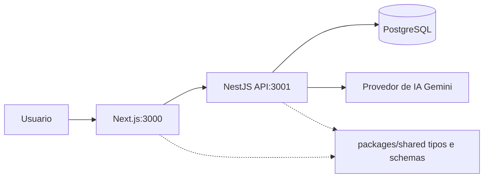

# Colab Challenge

Aplicação full stack para registro e classificacao de relatos de zeladoria urbana usando IA.

## Arquitetura

Esta solução usa um monorepo para manter frontend, backend e contratos compartilhados evoluindo juntos e facilitar a inicialização de todo o projeto usando Docker: o frontend em Next.js exibe o formulario de Solicitação ao usuario e faz a requisição post a API do backend NestJS, enquanto o backend organiza regras em módulos (como `ReportsModule`, `PrismaModule` e `AiModule`), persiste dados com Prisma no PostgreSQL e integra um provedor de IA para classificar relatos. Já o pacote `packages/shared` centraliza tipos e schemas reutilizados entre as camadas do frontend e backend para garantir consistência de dados e reduzir divergências de contrato.



- `apps/frontend`: Next.js
- `apps/backend`: NestJS + Prisma
- `packages/shared`: tipos e schemas compartilhados
- `postgres`: banco de dados via Docker

## Executando com Docker

1. Copie o arquivo de exemplo de ambiente na raiz:

```bash
cp .env.example .env
```

1. Preencha `GEMINI_API_KEY` no arquivo `.env`.

1. Suba os servicos:

```bash
docker compose up --build
```

## Endpoints locais

- Frontend: [http://localhost:3000](http://localhost:3000)
- Backend: [http://localhost:3001](http://localhost:3001)
- PostgreSQL: `localhost:5432`

## Observacoes

- O backend usa `DATABASE_URL` interno para o host `postgres` dentro da rede do Compose.
- O frontend usa `NEXT_PUBLIC_API_URL=http://localhost:3001` para chamadas feitas pelo navegador.
- O backend executa `prisma db push` na inicializacao do container para sincronizar schema no ambiente de desenvolvimento.
